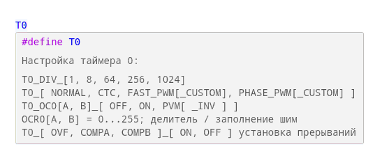
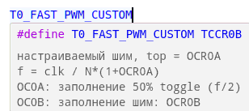

# Библиотека Timer

Помощник для простого использования таймеров.

---
### Система подсказок
Для начала, если хотим использовать таймер 0, вводим **`T0`**
Получаем подсказку:

Вводим интересующую строку и вновь получаем подсказку:

